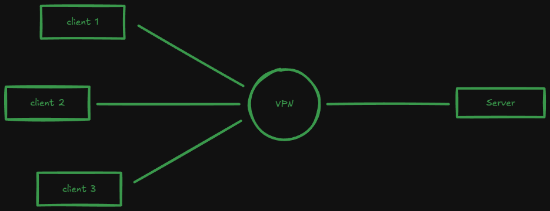
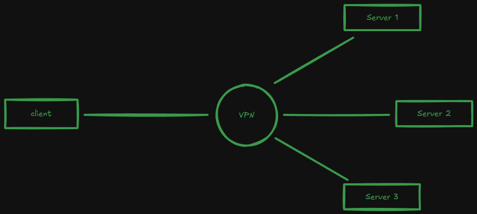
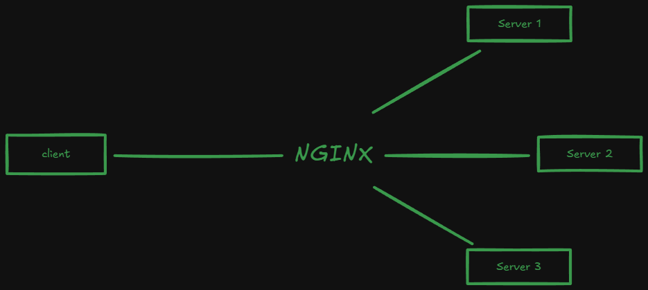
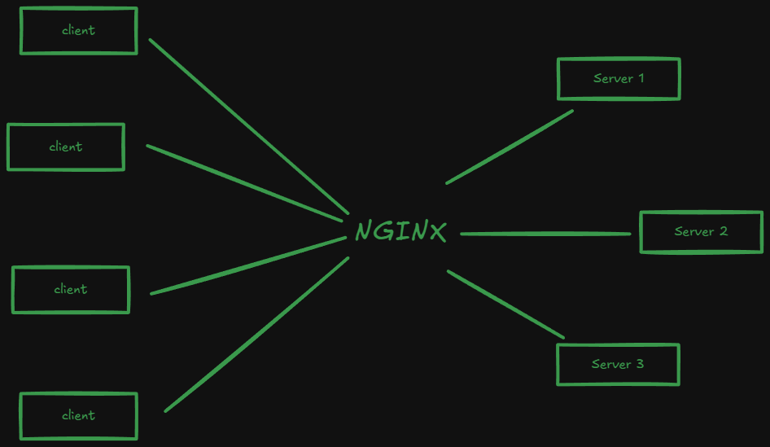

# Nginx

## Reverse Proxy

* First understand what is forward proxy -

#### Forward Proxy
 
* Normally, whenever we work with a server application, we have a client and a server, connected through a simple HTTP connection

* We know, a VPN is a proxy server, which helps to us to connect with a server

* We connect with VPN, and VPN connects with the actual server

    > Multiple clients communicate with VPN, and VPN communicate with a single server to serve the requests, this is called **Proxy Server** and this process is called **_Forward Proxy_**

* In *Forward Proxy*, The Server doesn't know, who is the client, as it is connected with the VPN only

* `For the Server, there is only one client`, i.e., the VPN, even though we can see, multiple clients are connected to the VPN

* Now that we have understood what Forward Proxy is, lets define what Reverse Proxy is

* In Forward proxy, we have multiple clients and single server, If we reverse this, *single client and multiple server*, this is called **Reverse Proxy**

* In **Reverse Proxy**, *the client doesn't know, which server will resolve the query/request*

* *It maybe possible, that these servers are running different applications*

* *Based on the users' request, the **Reverse Proxy Server** (Here, VPN) will direct the request to the destined server*

* The most popular *Reverse Proxy Server is Nginx*

> **Note**: We as user, never directly connect with the main server. We connect with a 'middle' server, say Nginx, which directs the request to the specific server, based on the rules and configurations defined by us.

## Load Balancing

* Nginx can also perform Load Balancing on the Servers

* It can act as a load balancer to distribute the traffic in a proper way, using any approach, like Round-robin

## HTTP Cache

* Nginx can Cache the responses for the requests to make the communication much more smooth and faster

* A high level structure of NGINX -

* We have multiple clients communicating with an NGINX server, which communicates with Multiple Server

* Clients don't directly connect with the main servers, they connect with the NGINX server, which then directs the request to the destined server, based on the rules and configurations defined, and then returns the responses back to the clients

* It can work as:

    * **API Gateway**: Direct the requests to the different servers based on the route, though which the request comes

    * **Reverse Proxy**

    * **HTTP Cache**

    * **Load Balancer**

* It can also handle SSL Certificates